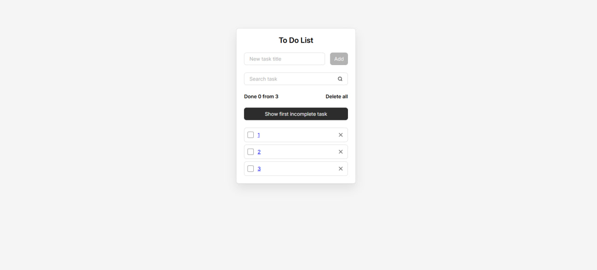

# React Todo App

React Todo App is a modern single-page application for task management, built with React and a scalable Feature-Sliced Design architecture.

The application demonstrates modern React development practices, including state management with hooks and reducers, Context API, modular styling, REST API integration, reusable components, and performance optimizations.



## 🚀 Features

- Create, edit, complete, and delete tasks
- Delete all tasks with confirmation
- Search tasks with highlighted matches
- Safe search highlighting with XSS protection
- Task persistence using JSON Server
- Full CRUD operations (GET, POST, PATCH, DELETE)
- Smooth task creation and deletion animations
- Scroll to the first incomplete task
- Automatic focus management for the task input
- Form validation with error handling
- Prevent adding empty tasks
- Custom client-side routing (without React Router)
- Optimized component rendering
- State management with `useReducer`
- Shared state via Context API
- Custom React hooks
- Feature-Sliced Design (FSD) architecture
- SCSS Modules styling

## 🛠 Tech Stack

- React
- JavaScript (ES6+)
- Vite
- SCSS Modules
- Feature-Sliced Design (FSD)
- Context API
- useReducer
- Custom Hooks
- JSON Server
- Fetch API

## 📁 Project Structure

The project follows the Feature-Sliced Design architecture.

```
src/
├── app/
├── pages/
├── widgets/
├── features/
├── entities/
└── shared/
```

This structure improves scalability, code organization, and maintainability.

## 📦 Project Setup

### ⚡ Installation

Clone the repository:

```bash
git clone https://github.com/Gidcher/to-do-react.git
cd react-todo-app
```

Install dependencies:

```bash
npm install
```

### ▶️ Run the application

Start the development server:

```bash
npm run dev
```

Start JSON Server:

```bash
npm run server
```

After that, open:

```
http://localhost:5173
```

> Make sure the JSON Server is running before using the application.